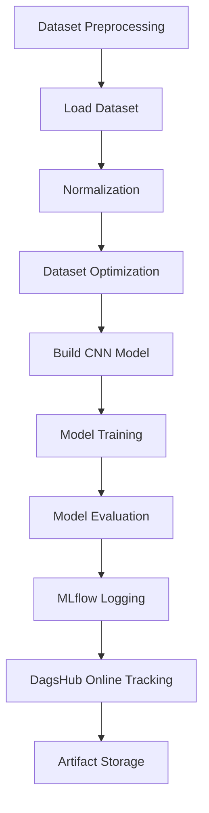
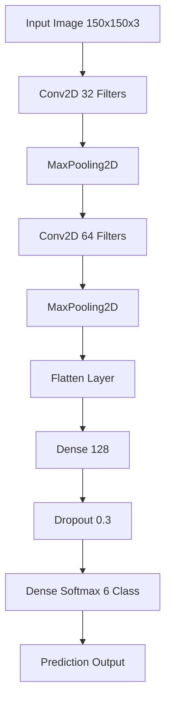
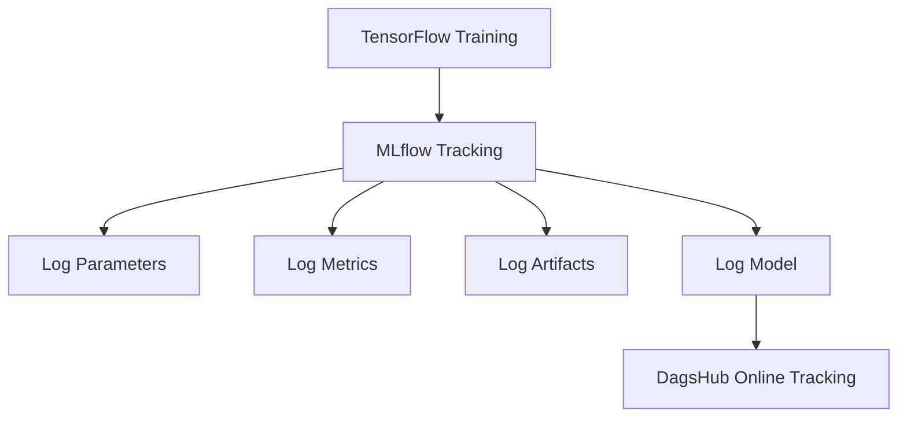
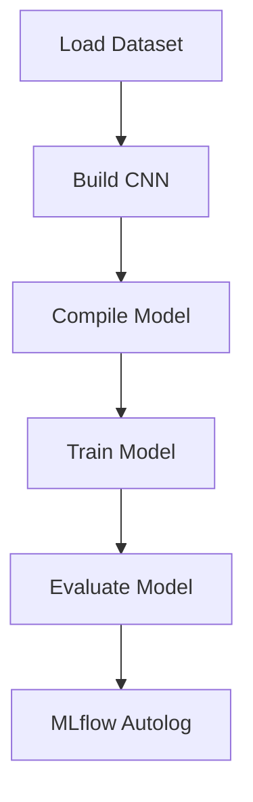
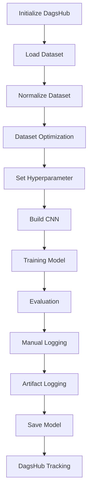

# Intel Image Classification with MLflow and DagsHub

## Project Overview

Project ini merupakan implementasi machine learning lifecycle menggunakan:

- TensorFlow
- MLflow
- DagsHub
- CNN (Convolutional Neural Network)

Tujuan utama project:

- melakukan training image classification,
- melakukan experiment tracking,
- menyimpan metrics,
- menyimpan artifact,
- melakukan online experiment tracking menggunakan DagsHub.

Dataset yang digunakan merupakan dataset preprocessing hasil Kriteria 1.

---

# Project Structure

```text
Membangun_model/
│
├── modelling.py
├── modelling_tuning.py
├── intel_image_preprocessing/
│   ├── train/
│   ├── val/
│   └── test/
│
├── cnn_model.keras
├── training_history.png
├── confusion_matrix.png
├── classification_report.txt
├── model_summary.txt
│
├── screenshot_dashboard.jpg
├── screenshot_artifak.jpg
│
├── requirements.txt
└── DagsHub.txt
```

---

# Dataset Information

Dataset:

- Intel Image Classification Dataset

Class:

- buildings
- forest
- glacier
- mountain
- sea
- street

Dataset telah melalui:

- preprocessing,
- splitting,
- normalization,
- optimization.

---

# Machine Learning Workflow



---

# CNN Architecture Flow



---

# MLflow Tracking Flow



---

# modelling.py Workflow



---

# modelling_tuning.py Workflow



---

# Technologies Used

| Technology   | Description                |
| ------------ | -------------------------- |
| TensorFlow   | Deep Learning Framework    |
| MLflow       | Experiment Tracking        |
| DagsHub      | Online Experiment Tracking |
| Matplotlib   | Visualization              |
| Scikit-Learn | Evaluation Metrics         |
| NumPy        | Numerical Computation      |

---

# Hyperparameter Configuration

| Hyperparameter | Value   |
| -------------- | ------- |
| Image Size     | 150x150 |
| Batch Size     | 32      |
| Learning Rate  | 0.001   |
| Dropout Rate   | 0.3     |
| Epoch          | 5       |

---

# Metrics Logged

MLflow dan DagsHub menyimpan:

- accuracy
- val_accuracy
- loss
- val_loss
- test_accuracy
- test_loss

---

# Artifacts Logged

Project ini menyimpan artifact berikut:

- training_history.png
- confusion_matrix.png
- classification_report.txt
- model_summary.txt
- cnn_model.keras

---

# DagsHub Repository

Repository DagsHub:

https://dagshub.com/arif76440/MLFlow-Image-Classification

---

# How to Run Project

## 1. Install Dependencies

```bash
pip install -r requirements.txt
```

---

## 2. Login DagsHub

```bash
dagshub login
```

---

## 3. Run MLflow UI

```bash
mlflow ui
```

Open browser:

```text
http://127.0.0.1:5000
```

---

## 4. Run Training

### modelling.py

```bash
python modelling.py
```

### modelling_tuning.py

```bash
python modelling_tuning.py
```

---

# MLflow Dashboard

MLflow dashboard digunakan untuk:

- melihat metrics,
- melihat parameters,
- melihat artifact,
- melihat experiment tracking.

---

# DagsHub Integration

DagsHub digunakan untuk:

- online experiment tracking,
- menyimpan experiment history,
- monitoring metrics,
- menyimpan artifact online.

---

# Evaluation Result

Model berhasil melakukan:

- image classification,
- experiment tracking,
- artifact logging,
- online monitoring menggunakan DagsHub.

---

# Author

Nama:
Muh Arifandi

Project:
Machine Learning Lifecycle with MLflow and DagsHub
